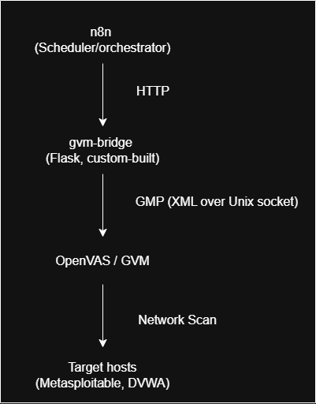

# Architecture & Design

## System Overview

n8n triggers the pipeline on a schedule. It calls a custom bridge over HTTP. The bridge translates those calls into GMP, GVM's own protocol, sent over a Unix socket shared with gvmd through a Docker volume. gvmd runs the actual scan through the OpenVAS scanner engine. Once the scan is done, the bridge fetches the report and n8n saves it to disk.

## Key Decision: Why a custom bridge?

**Problem:** n8n (and most no-code orchestration tools) can only make HTTP requests. OpenVAS/GVM communicates over GMP, an XML-based protocol sent over a raw TCP/TLS socket. It is not possible for n8n's built-in HTTP request node to talk to GVM directly.

**Options considered:**

1. **Build custom HTTP-GMP bridge** (chosen) - a small lightweight service using Greenbone's official `python-gvm` library.
2. **Use `gvm-cli` via n8n Execute Command node** - avoids writing a persistent service, but requires installing `gvm-tools` inside the n8n container/image and constructing raw GMP XML strings per call. Comparable to option 1 in terms of effort, but less reusable and versatile for future phases.
3. **Switch to a scanner with a native REST API (e.g. Nessus)** - would eliminate the translation problem entirely. Nessus exposes a documented JSON REST API. Rejected because (a) Nessus is proprietary, which conflicts with the project's all-open-source design goal, (b) the custom bridge is a more differentiated piece of engineering with no well-maintained open-source equivalent currently existing.

**Prior art checked:** [`MixewayOpenVASRestAPI`](https://github.com/Mixeway/MixewayOpenVASRestAPI) exists but targets a pre-GVM11 socket protocol and appears unmaintained. No n8n community node exists for GVM/OpenVAS as of this writing.

## Networking

Two Docker networks are involved, `greenbone-community-edition_default` (GVM stack) and `n8n-local_default` (n8n). These are isolated from each other by default.

gvm-bridge is attached to both. In practice it only strictly needs `n8n-local_default`, since its connection to gvmd goes through the shared socket volume rather than the network. It is also attached to the Greenbone network for consistency, though this is not required for current functionality.

Confirmed cross-network reachability with a disposable alpine container before building anything, and confirmed the final bridge container resolves and is reachable by name from n8n_automation once both networks were attached.

## Report format & data extraction

Reports are returned by the bridge as raw XML, wrapped in a JSON field (`report_xml`). Parsing this into structured fields (host, CVE, severity, port) is planned as a follow-up step, not yet built. Right now the saved output is the full raw report, which is complete but not yet friendly to read at a glance.

## Key Decision: track scans by report_id, not task_id

A GVM task can only run one scan at a time, but relying on the task's general status risks ambiguity if a scan is ever triggered again while something else is still polling. Capturing the exact report_id GVM returns the moment a scan starts, and polling that specific id, removes this ambiguity entirely. The one time `/report/<task_id>` convenience endpoint still uses task_id, since it only runs once completion is already confirmed by report_id, when there is no ambiguity left.

## Lessons learned during setup

### GMP is not exposed over TCP by default in the official Community Containers

**Assumption going in:** gvmd would be reachable via GMP over TCP port 9390, consistent with general GMP documentation and older GVM deployment guides.

**What we found:** the official Greenbone Community Containers stack keeps gvmd's GMP interface as a Unix socket only, shared with gsad via a Docker named volume (`gvmd_socket_vol`). Port 9390 is not listening by default.

**How this was diagnosed:** rather than guessing, a disposable container was attached to both the Greenbone and n8n Docker networks and used to test reachability directly:
- `ping` to a container on the other network succeeded, confirming cross-network connectivity itself was working correctly.
- `curl telnet://gvmd:9390` resolved DNS correctly but returned "Connection refused", a meaningfully different result from a timeout. A refused connection means the network path is fine but nothing is listening on that port. A timeout would have suggested a network/firewall problem instead. This distinction pointed the investigation directly at gvmd's configuration rather than Docker networking.

**Why the fix isn't "just enable the TCP port":** community forum reports show that forcing TCP access via `GVMD_ARGS: "--port=9390 --listen=0.0.0.0"` has caused gvmd instability and crash-looping for other users. Greenbone's own documented pattern for external GMP access is to mount the existing `gvmd_socket_vol` volume into another container and connect via Unix socket, the same approach their own official `gvm-tools` container uses.

**Resulting design decision:** `gvm-bridge` connects to gvmd via `UnixSocketConnection` against the shared `gvmd_socket_vol` volume, rather than `TLSConnection` over TCP. This also removes the need for TLS certificate configuration entirely, simplifying the bridge.

### XML structure should be confirmed, not assumed

Two separate bugs came from guessing GMP's XML shape instead of checking it directly. `scan_run_status` was assumed to be an attribute on the report element, when it is actually its own child element nested one level deeper than expected. The fix both times was the same, dump the raw XML directly and read it, rather than keep guessing at the structure.

### Docker image caching means edits do nothing until rebuilt

Editing app.py does not change anything about a running container on its own. This bit twice during development, once when the fix genuinely wasn't rebuilt, and once when the rebuild happened but the old container was never actually replaced. Confirming the image id changes between builds became the standard check after this happened the second time.

### Application level restrictions can look identical to permission errors

n8n's Read/Write Files from Disk node failed with "the file is not writable" even though a direct `docker exec touch` proved OS level permissions were fine. The actual cause was n8n's own `N8N_RESTRICT_FILE_ACCESS_TO` environment variable, which blocks writes to any folder not explicitly listed, independent of real filesystem permissions. Fixed by adding the target folder to that variable and recreating the container.

### Secrets do not belong in source files bound for a public repo

GVM_PASSWORD was originally hardcoded directly in app.py. Since this repo is public, that would have exposed the real password permanently in git history. Fixed by reading it from an environment variable at runtime instead, with a fail fast check that raises a clear error on startup if the variable is missing, rather than failing confusingly later during the first real request.

## Known limitations

- Error handling in the n8n workflow currently covers the Start Scan step only, since that is the one failure mode actually observed during development (attempting to start a task that is already running). Other steps do not yet have dedicated error branches.
- The polling loop has no maximum retry limit. A scan that never finishes would cause the workflow to loop forever. Acceptable for a single target right now, worth revisiting before adding more targets.
- Currently scans one target only. Adding a second target would mean duplicating parts of the workflow rather than looping over a list, which is the more correct long term design once multiple targets are actually needed.
- Report output is raw XML, not yet parsed into structured fields.

> Note: The report_format_id is not plain XML output as assumed earlier. It is rather Greenbone's CSV Results format with report data encoded in base64 CSV text embeded inside the outer XML wrapper. This does not break anything. However, an additional manual decode step is required for human readble format (to be covered in phase 2 of the automation pipeline).

## Roadmap

This is the first phase of a larger SOAR project. Planned next phases:

- Structured report parsing into clean JSON or CSV
- Jira ticketing automation
- Wazuh SIEM integration, alert enrichment, and open source threat intel
- Local LLM (Ollama/Llama3) triage and documentation assistance
- Suricata IDS implementation and Wireshark packet analysis
- GRC and compliance automation